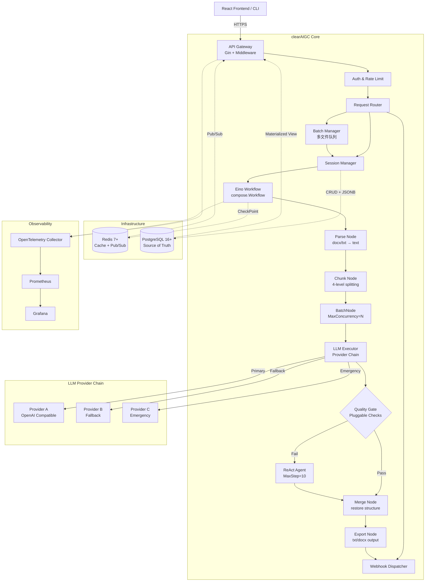
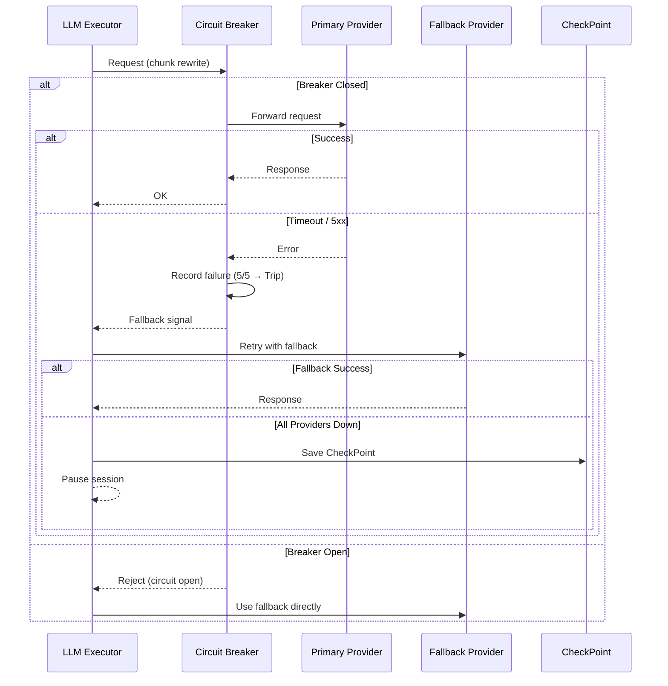

# clearAIGC — 架构愿景

## 核心原则

1. **可预测性优先**：文档处理序列（解析 → 分块 → 改写 → 质检 → 合并 → 导出）是硬编码的确定性 DAG，不依赖 LLM 决策。
2. **受限 AI**：LLM 是执行者（改写 chunk）和消防员（修复失败 chunk），不是管理者。
3. **有约束的并发**：Goroutine 能力无限，LLM API 速率有限。BatchNode + Token Bucket + Circuit Breaker 三层管控。
4. **持久化即真相**：PostgreSQL 是唯一数据权威来源。Redis 是加速层，丢失不影响正确性。
5. **可观测性内建**：OpenTelemetry 追踪贯穿每个 Workflow 节点，不是事后补丁。
6. **弹性优先**：每一层都为失败做好准备——LLM 超时有熔断、chunk 失败有 Agent 修复、服务中断有 CheckPoint 恢复。

## 系统全景



## 数据流

一个完整的文档处理请求经过以下阶段：

```
用户上传 .docx/.txt
  → API 校验文件格式和大小 (≤50MB)
  → 创建 Session (PostgreSQL)
  → 启动 Eino Workflow
    → ParseNode: 提取纯文本，检测编码，标准化换行
    → ChunkNode: 4 级分块，生成 Manifest (PostgreSQL JSONB)
      → 构建每个 chunk 的 prompt（注入轮次模板 + 输出契约）
    → BatchNode: 并发调用 LLM 改写每个 chunk
      → 每个 chunk 完成后: Redis Pub/Sub → SSE 推送前端
      → 每个 chunk 完成后: Redis CheckPoint 保存快照
      → 限流: Token Bucket (RPM + TPM) + Circuit Breaker
    → QualityGateNode: 可插拔的确定性检查
      → 通过: 直接进入合并
      → 失败: ReAct Agent 尝试修复
        → 工具链: retry_strict / split_rewrite / accept / terminology
        → MaxStep=10，超限标记需人工介入
        → 修复成功: 进入合并
        → 修复失败: 标记 failed，记录原因
    → MergeNode: 按原段落结构重组，保持段落顺序和空行
    → ExportNode: 生成 .txt / .docx 输出文件
  → 更新 Session/Round 状态 (PostgreSQL 事务)
  → SSE 推送 complete 事件 (含评分、统计、下载链接)
  → 触发 Webhook 回调 (如已配置)
```

## LLM Provider 容灾链



## 价值主张

| 能力 | 说明 |
| :--- | :--- |
| 高吞吐 | BatchNode 并发处理 chunk，单文档处理时间从分钟级降到秒级 |
| 高可靠 | Eino CheckPoint + Redis 实现任意断点续传，服务重启不丢进度 |
| 自愈能力 | ReAct Agent 自动修复 80%+ 的质量门控失败，减少人工干预 |
| 弹性容灾 | 多 Provider 链式切换 + 熔断器 + CheckPoint，LLM 故障不丢数据 |
| 可观测 | 每个 chunk 的处理耗时、LLM token 消耗、质量检查通过率全部可追踪 |
| 多租户 | Session 级资源隔离，PostgreSQL Row-Level Security |
| 水平扩展 | 无状态 API 层 + 有状态存储层分离，K8s HPA 自动扩缩 |
| 可插拔 | 质量检查器、LLM Provider、导出格式均可扩展 |
| 批量处理 | 多文件上传 + 任务队列 + 优先级调度 |
| 事件驱动 | Webhook 回调 + SSE 实时流，集成外部系统 |

## Eino 框架选型依据

| 特性 | 说明 |
| :--- | :--- |
| 静态类型编排 | Go 泛型实现编译期类型检查，节点间数据传递类型安全 |
| Workflow/Graph/Chain 三级 | Workflow(DAG) 用于主管线，Graph(循环) 用于 ReAct，Chain 用于线性子流程 |
| 原生 BatchNode | MaxConcurrency 信号量、Interrupt 收集、Callback 集成 |
| 原生 Interrupt & CheckPoint | CheckPointStore 接口 (KV: string→[]byte)，Redis 实现即插即用 |
| Callback 机制 | OnStart/OnEnd/OnError 跨切面注入，天然适配 OpenTelemetry |
| ADK 扩展 | SequentialAgent、LoopAgent、ParallelAgent 为未来多 Agent 协作预留空间 |

## 非功能性需求

| 维度 | 目标 |
| :--- | :--- |
| 延迟 | 单 chunk 改写 P95 < 5s（取决于 LLM Provider） |
| 吞吐 | 单实例 ≥ 20 并发 chunk，集群线性扩展 |
| 可用性 | 99.5%（LLM Provider 不可用时自动暂停，不丢失数据） |
| 恢复时间 | CheckPoint 恢复 < 3s |
| 数据保留 | Session 数据默认保留 90 天，可配置 |
| 文件大小 | 单文件 ≤ 50MB |
| 并发 Session | 单实例 ≥ 50 并发 Session |
