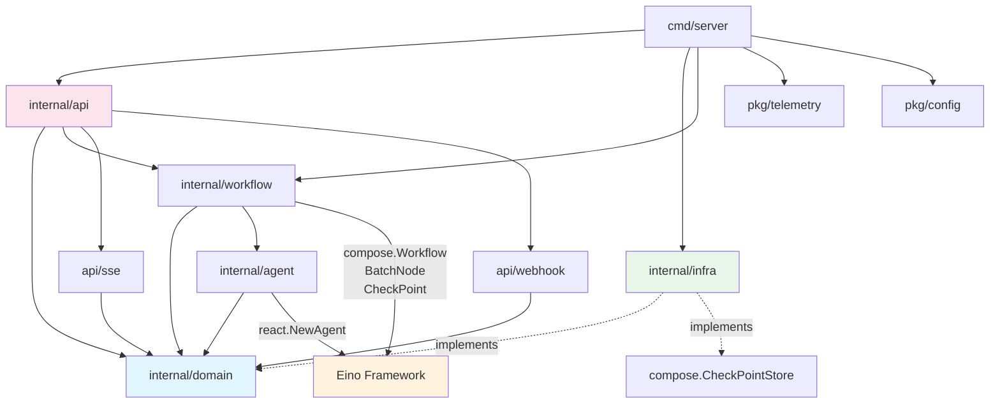

# clearAIGC — 模块设计

## 1. 包结构

```text
clearAIGC/
├── cmd/
│   └── server/                      # 应用入口
│       └── main.go                  # 依赖注入、启动/关闭编排
├── internal/
│   ├── domain/                      # 核心业务实体和接口（零外部依赖）
│   │   ├── document.go              # Document, Session, SessionStatus
│   │   ├── chunk.go                 # Chunk, Manifest, ChunkMetric, ParagraphMapping
│   │   ├── prompt.go                # PromptProfile, OutputContract, DisallowedPatterns
│   │   ├── quality.go               # QualityReport, CheckType, CheckResult, RecoveryResult
│   │   ├── round.go                 # Round, RoundStatus
│   │   ├── provider.go              # ProviderConfig, ProviderChain, FallbackPolicy
│   │   ├── webhook.go               # WebhookConfig, WebhookEvent, WebhookDelivery
│   │   ├── batch.go                 # BatchJob, BatchStatus, Priority
│   │   └── interfaces.go            # Repository / Service 接口定义
│   ├── workflow/                    # Eino Workflow 编排
│   │   ├── pipeline.go              # 主 compose.Workflow 构建与编译
│   │   ├── prompt_builder.go        # prompt 模板构建 + OutputContract 注入
│   │   ├── prompt_engine.go         # Prompt 策略引擎（模板加载、变量替换、版本管理）
│   │   └── nodes/
│   │       ├── parse.go             # 文档解析 (docx/txt → 纯文本，编码检测)
│   │       ├── chunk.go             # 4 级分块策略
│   │       ├── llm_exec.go          # BatchNode 包装，并发 LLM 调用 + Provider Chain
│   │       ├── quality_gate.go      # 可插拔质量检查 (Checker 接口)
│   │       ├── merge.go             # 按段落结构重组文本
│   │       └── export.go            # 输出格式转换 (txt/docx)
│   ├── agent/                       # ReAct Agent（质量修复）
│   │   ├── supervisor.go            # react.NewAgent 初始化 + 系统 prompt + MaxStep
│   │   └── tools/
│   │       ├── retry_strict.go      # 严格约束重试（注入失败原因 + 更强约束 prompt）
│   │       ├── split_rewrite.go     # 拆分过长 chunk 后分别重写
│   │       ├── accept.go            # 逃生舱口（误报处理，需记录原因）
│   │       └── terminology.go       # 术语字典查询（Phase 4+）
│   ├── infra/                       # 基础设施适配器
│   │   ├── postgres/                # PostgreSQL 实现
│   │   │   ├── session_repo.go      # Session CRUD + Advisory Lock
│   │   │   ├── round_repo.go        # Round CRUD + 事务原子提交
│   │   │   ├── manifest_repo.go     # Manifest JSONB + GIN 索引查询
│   │   │   ├── quality_repo.go      # QualityReport 批量写入 + 统计聚合
│   │   │   ├── webhook_repo.go      # Webhook 配置和交付记录
│   │   │   └── migrations/          # golang-migrate SQL 文件（版本化迁移）
│   │   ├── redis/                   # Redis 多角色实现
│   │   │   ├── checkpoint.go        # Eino CheckPointStore (KV: string→[]byte)
│   │   │   ├── cache.go             # Session 状态缓存（TTL + 回源）
│   │   │   ├── pubsub.go            # 进度事件 Pub/Sub（chunk → SSE）
│   │   │   └── llm_cache.go         # LLM 响应缓存（prompt hash → response, 24h TTL）
│   │   └── llm/                     # LLM Provider 适配
│   │       ├── client.go            # OpenAI 兼容客户端（chat/completions）
│   │       ├── provider_chain.go    # 多 Provider 容灾链（Primary → Fallback → Emergency）
│   │       ├── rate_limiter.go      # RPM + TPM Token Bucket 双层限流
│   │       └── circuit.go           # gobreaker 熔断器（5 次连续失败触发）
│   └── api/                         # HTTP 层
│       ├── router.go                # 路由注册 + Middleware 链
│       ├── middleware/
│       │   ├── auth.go              # JWT 认证（Phase 5 启用）
│       │   ├── ratelimit.go         # API 限流（令牌桶 / 滑动窗口）
│       │   ├── cors.go              # CORS 配置
│       │   ├── trace.go             # OpenTelemetry trace-id 注入
│       │   └── recovery.go          # Panic 恢复 + 结构化错误日志
│       ├── handler/
│       │   ├── session.go           # Session CRUD + 批量上传
│       │   ├── round.go             # Round 控制 (start/pause/resume)
│       │   ├── export.go            # 文件下载 (txt/docx)
│       │   ├── diff.go              # 输入输出 diff 对比
│       │   ├── config.go            # 模型配置 + Provider 管理
│       │   ├── webhook.go           # Webhook 配置管理
│       │   └── health.go            # 健康检查（PG + Redis + LLM 探活）
│       ├── sse/
│       │   └── streamer.go          # SSE 事件流（Redis Pub/Sub → HTTP flush）
│       └── webhook/
│           └── dispatcher.go        # Webhook 分发（异步 + 重试 + 签名）
├── pkg/
│   ├── config/                      # Viper 配置加载（文件 + 环境变量）
│   ├── logger/                      # 结构化日志 (slog + trace-id 关联)
│   └── telemetry/                   # OpenTelemetry 初始化 (Tracer + Meter + Logger)
├── prompts/                         # Prompt 模板文件
│   ├── round1_cn.md                 # 中文 Round 1: 词汇降维 + 句式扩展
│   ├── round2_cn.md                 # 中文 Round 2: AI 套话清除 + 节奏重构
│   └── round1_en.md                 # 英文 Round 1: 模板打破 + 自然粗糙度注入
└── deploy/
    ├── Dockerfile                   # 多阶段构建（builder + runner）
    ├── docker-compose.yml           # 本地开发 (PG + Redis + App + Prometheus + Grafana)
    └── k8s/                         # Kubernetes manifests
        ├── deployment.yaml
        ├── service.yaml
        ├── ingress.yaml
        ├── hpa.yaml
        └── configmap.yaml
```

## 2. 领域模型

### 2.1 核心实体

```go
type DocumentFormat string

const (
    FormatTXT  DocumentFormat = "txt"
    FormatDOCX DocumentFormat = "docx"
)

// Document 代表一个待处理的文档
type Document struct {
    ID         uuid.UUID
    OriginPath string          // 原始文件路径
    Format     DocumentFormat  // txt | docx
    RawText    string          // 提取后的纯文本
    SizeBytes  int64           // 原始文件大小
    CreatedAt  time.Time
}

type SessionStatus string

const (
    SessionPending    SessionStatus = "pending"
    SessionProcessing SessionStatus = "processing"
    SessionPaused     SessionStatus = "paused"
    SessionCompleted  SessionStatus = "completed"
    SessionFailed     SessionStatus = "failed"
)

// Session 代表一次完整的文档处理会话
type Session struct {
    ID            uuid.UUID
    DocumentID    uuid.UUID
    PromptProfile PromptProfile  // cn | en
    Status        SessionStatus
    Rounds        []Round
    TenantID      string         // 多租户隔离 (Phase 5)
    CreatedAt     time.Time
    UpdatedAt     time.Time
}

type RoundStatus string

const (
    RoundPending    RoundStatus = "pending"
    RoundProcessing RoundStatus = "processing"
    RoundPaused     RoundStatus = "paused"
    RoundCompleted  RoundStatus = "completed"
    RoundFailed     RoundStatus = "failed"
)

// Round 代表一轮改写
type Round struct {
    ID               uuid.UUID
    SessionID        uuid.UUID
    Number           int            // 1 或 2
    PromptPath       string         // prompt 模板路径
    InputPath        string
    OutputPath       string
    ManifestID       uuid.UUID
    CheckPointID     string         // Eino CheckPoint 标识
    ScoreTotal       *int           // 质量评分 (0-70)
    ChunkLimit       int            // 默认 850
    InputSegments    int
    OutputSegments   int
    Status           RoundStatus
    StartedAt        *time.Time
    CompletedAt      *time.Time
    CreatedAt        time.Time
}
```

### 2.2 分块模型

```go
type ChunkStatus string

const (
    ChunkPending    ChunkStatus = "pending"
    ChunkProcessing ChunkStatus = "processing"
    ChunkPassed     ChunkStatus = "passed"
    ChunkFailed     ChunkStatus = "failed"
    ChunkRecovered  ChunkStatus = "recovered"
)

// Chunk 代表一个处理单元
type Chunk struct {
    ID             string       // "p{paragraph}_c{index}"
    ParagraphIndex int
    ChunkIndex     int
    InputText      string
    OutputText     string
    CharCount      int          // 中文字符数
    WordCount      int          // 英文单词数
    Status         ChunkStatus
}

// ParagraphMapping 记录段落到 chunk 的映射关系
type ParagraphMapping struct {
    Index       int    // 段落在原文中的位置
    StartChunk  int    // 该段落的第一个 chunk 索引
    EndChunk    int    // 该段落的最后一个 chunk 索引
    OriginalText string // 原始段落文本（用于结构恢复）
}

// Manifest 代表一轮处理的分块清单
type Manifest struct {
    ID             uuid.UUID
    RoundID        uuid.UUID
    ChunkLimit     int
    ChunkMetric    ChunkMetric  // char | word
    Paragraphs     []ParagraphMapping
    Chunks         []Chunk
    ParagraphCount int
    ChunkCount     int
}

// ChunkMetric 决定分块度量方式
type ChunkMetric string

const (
    ChunkMetricChar ChunkMetric = "char"  // 中文按字符
    ChunkMetricWord ChunkMetric = "word"  // 英文按单词
)
```

### 2.3 质量模型

```go
type CheckType string

const (
    // Phase 2: 基础检查
    CheckEmpty             CheckType = "empty"
    CheckDisallowedPattern CheckType = "disallowed_pattern"
    CheckMarkdownInjection CheckType = "markdown_injection"
    CheckAbnormalExpansion CheckType = "abnormal_expansion"
    // Phase 3: 增强检查
    CheckLengthDeviation   CheckType = "length_deviation"
    CheckStructureBreak    CheckType = "structure_break"
    // Phase 4: 高级检查
    CheckTerminologyDrift  CheckType = "terminology_drift"
)

type CheckResult struct {
    Type    CheckType
    Passed  bool
    Reason  string     // 失败原因描述
}

// QualityReport 代表一个 chunk 的质量检查结果
type QualityReport struct {
    ChunkID       string
    Checks        []CheckResult
    AllPassed     bool
    FailedChecks  []CheckType
}

// Checker 可插拔的质量检查器接口
type Checker interface {
    Type() CheckType
    Check(ctx context.Context, input, output string) (passed bool, reason string)
}

// QualityStats 轮次级质量统计
type QualityStats struct {
    TotalChunks     int
    PassedChunks    int
    FailedChunks    int
    RecoveredChunks int
    PassRate        float64
    RecoveryRate    float64
    ByCheckType     map[CheckType]int // 每种检查类型的失败次数
}
```

### 2.4 Prompt 配置

```go
// PromptProfile 定义语言模式的处理规则
type PromptProfile struct {
    Name       string      // "cn" | "en"
    MaxRounds  int         // cn=2, en=1
    Metric     ChunkMetric // cn=char, en=word
    Prompts    []string    // 每轮对应的 prompt 模板路径
}

// OutputContract 定义输出约束（注入到每个 chunk prompt 中）
type OutputContract struct {
    Text               string   // 约束文本块
    DisallowedPatterns []string // 9 个禁止模式的正则表达式
}

var Profiles = map[string]PromptProfile{
    "cn": {
        Name:      "cn",
        MaxRounds: 2,
        Metric:    ChunkMetricChar,
        Prompts:   []string{"prompts/round1_cn.md", "prompts/round2_cn.md"},
    },
    "en": {
        Name:      "en",
        MaxRounds: 1,
        Metric:    ChunkMetricWord,
        Prompts:   []string{"prompts/round1_en.md"},
    },
}
```

### 2.5 Provider 配置

```go
// ProviderConfig 单个 LLM Provider 的配置
type ProviderConfig struct {
    Name     string  // 标识名（如 "openai", "deepseek"）
    BaseURL  string  // API 端点
    APIKey   string  // 加密存储，运行时解密
    Model    string  // 模型名
    Priority int     // 优先级（数字越小优先级越高）
    RPMLimit int     // 每分钟请求数上限
    TPMLimit int     // 每分钟 token 数上限
    Timeout  time.Duration
}

// ProviderChain 多 Provider 容灾链
type ProviderChain struct {
    Providers []ProviderConfig // 按优先级排序
}
```

### 2.6 Webhook 配置

```go
type WebhookEventType string

const (
    EventRoundCompleted   WebhookEventType = "round.completed"
    EventSessionCompleted WebhookEventType = "session.completed"
    EventQualityAlert     WebhookEventType = "quality.alert"
    EventSessionFailed    WebhookEventType = "session.failed"
)

// WebhookConfig 外部回调配置
type WebhookConfig struct {
    ID        uuid.UUID
    URL       string             // 回调地址
    Secret    string             // HMAC-SHA256 签名密钥
    Events    []WebhookEventType // 订阅的事件类型
    Active    bool
    CreatedAt time.Time
}

// WebhookDelivery 回调投递记录
type WebhookDelivery struct {
    ID         uuid.UUID
    WebhookID  uuid.UUID
    EventType  WebhookEventType
    Payload    json.RawMessage
    StatusCode int
    Attempts   int
    LastError  string
    DeliveredAt *time.Time
}
```

### 2.7 接口定义

```go
// SessionRepository 会话持久化
type SessionRepository interface {
    Create(ctx context.Context, session *Session) error
    GetByID(ctx context.Context, id uuid.UUID) (*Session, error)
    UpdateStatus(ctx context.Context, id uuid.UUID, status SessionStatus) error
    ListHistory(ctx context.Context, opts ListOptions) ([]SessionSummary, int, error)
    Delete(ctx context.Context, id uuid.UUID) error
    AcquireLock(ctx context.Context, id uuid.UUID) (unlock func(), err error)
}

// RoundRepository 轮次持久化
type RoundRepository interface {
    Create(ctx context.Context, round *Round) error
    GetBySessionAndNumber(ctx context.Context, sessionID uuid.UUID, number int) (*Round, error)
    Update(ctx context.Context, round *Round) error
    CompleteRound(ctx context.Context, round *Round, manifest *Manifest, reports []QualityReport) error
}

// ManifestRepository 分块清单持久化
type ManifestRepository interface {
    Create(ctx context.Context, manifest *Manifest) error
    GetByRoundID(ctx context.Context, roundID uuid.UUID) (*Manifest, error)
    QueryChunk(ctx context.Context, roundID uuid.UUID, chunkID string) (*Chunk, error)
}

// QualityRepository 质量报告持久化
type QualityRepository interface {
    BatchCreate(ctx context.Context, reports []QualityReport) error
    GetFailedByRound(ctx context.Context, roundID uuid.UUID) ([]QualityReport, error)
    GetStatsByRound(ctx context.Context, roundID uuid.UUID) (*QualityStats, error)
}

// LLMClient LLM 调用抽象
type LLMClient interface {
    Complete(ctx context.Context, messages []Message, opts ...LLMOption) (string, error)
    Stream(ctx context.Context, messages []Message, opts ...LLMOption) (<-chan string, error)
    Provider() string // 当前使用的 Provider 名称
}

// ProviderSelector 多 Provider 选择策略
type ProviderSelector interface {
    Select(ctx context.Context) (LLMClient, error)
    ReportFailure(ctx context.Context, provider string, err error)
    ReportSuccess(ctx context.Context, provider string)
}

// ProgressPublisher 进度事件发布
type ProgressPublisher interface {
    Publish(ctx context.Context, sessionID uuid.UUID, event ProgressEvent) error
    Subscribe(ctx context.Context, sessionID uuid.UUID) (<-chan ProgressEvent, func(), error)
}

// WebhookDispatcher Webhook 事件分发
type WebhookDispatcher interface {
    Dispatch(ctx context.Context, event WebhookEventType, payload interface{}) error
    RegisterHook(ctx context.Context, config *WebhookConfig) error
    RemoveHook(ctx context.Context, id uuid.UUID) error
}
```

## 3. 依赖流



**依赖规则**：

| 包 | 可依赖 | 禁止依赖 |
| :--- | :--- | :--- |
| `domain` | Go 标准库 | 任何外部包 |
| `workflow` | `domain`, Eino | `infra`, `api` |
| `agent` | `domain`, Eino | `infra`, `api` |
| `infra` | `domain`, 三方库 (gorm, redis, gobreaker) | `workflow`, `agent`, `api` |
| `api` | `domain`, `workflow`, Gin | `infra`（通过接口解耦） |
| `pkg/*` | Go 标准库, 三方库 | `internal/*` |

## 4. 启动与关闭

### 4.1 依赖注入

`cmd/server/main.go` 负责构建完整的依赖图：

```go
func main() {
    cfg := config.Load()
    
    // Infrastructure
    db := postgres.Connect(cfg.Database)
    rdb := redis.Connect(cfg.Redis)
    
    // Repositories
    sessionRepo := postgres.NewSessionRepo(db)
    roundRepo := postgres.NewRoundRepo(db)
    manifestRepo := postgres.NewManifestRepo(db)
    qualityRepo := postgres.NewQualityRepo(db)
    
    // LLM Provider Chain
    providerChain := llm.NewProviderChain(cfg.Providers)
    
    // Eino Components
    checkpointStore := redis.NewCheckPointStore(rdb)
    publisher := redis.NewProgressPublisher(rdb)
    
    // Workflow
    pipeline := workflow.NewPipeline(providerChain, checkpointStore, publisher)
    
    // API
    router := api.NewRouter(sessionRepo, roundRepo, manifestRepo, qualityRepo, pipeline, publisher)
    
    // Graceful shutdown
    server := &http.Server{Addr: cfg.Listen, Handler: router}
    graceful.Run(server, db, rdb)
}
```

### 4.2 优雅关闭

```go
func Run(server *http.Server, db *gorm.DB, rdb *redis.Client) {
    go server.ListenAndServe()
    
    quit := make(chan os.Signal, 1)
    signal.Notify(quit, syscall.SIGINT, syscall.SIGTERM)
    <-quit
    
    // 1. 停止接收新请求
    ctx, cancel := context.WithTimeout(context.Background(), 30*time.Second)
    defer cancel()
    server.Shutdown(ctx)
    
    // 2. 等待进行中的 Workflow 保存 CheckPoint
    // (Eino Interrupt 会在 ctx 取消时自动触发)
    
    // 3. 关闭数据库连接
    sqlDB, _ := db.DB()
    sqlDB.Close()
    rdb.Close()
}
```
