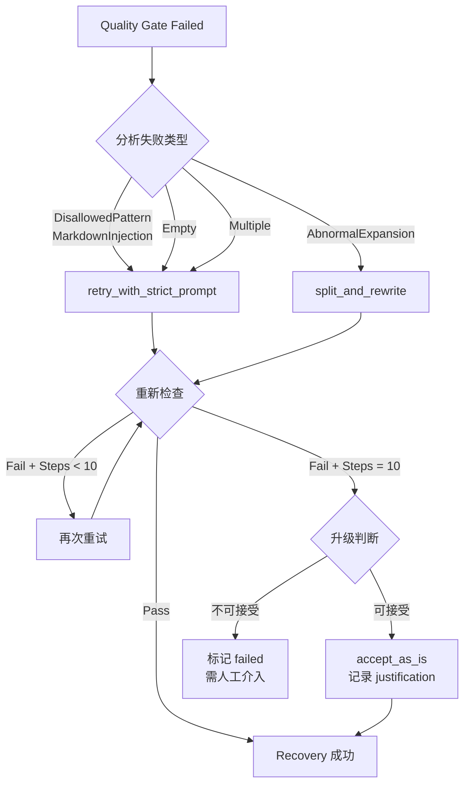
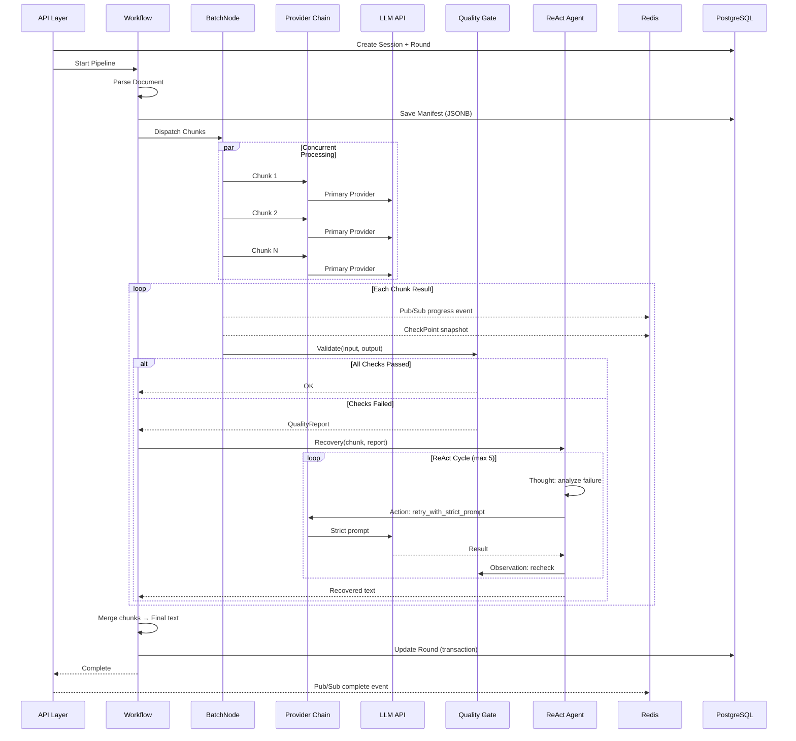

# clearAIGC — Workflow 与 ReAct 策略

## 1. 确定性管线（外层 Workflow）

### 1.1 为什么选择 Workflow

| 特性 | `compose.Workflow` | `compose.Graph` |
| :--- | :--- | :--- |
| 拓扑 | DAG（无循环） | 支持循环 |
| 数据映射 | 字段级（上游字段 → 下游字段） | 整体类型对齐 |
| NodeTriggerMode | 固定 `AllPredecessor` | 可配置 |
| 用途 | 主处理管线 | ReAct Agent 内部 |

外层管线是严格的 DAG：解析 → 分块 → 批处理 → 质检 → 合并。不需要循环，Workflow 的字段级映射更适合在节点间传递不同结构的数据。

### 1.2 处理流程

```
Parse → Chunk → BatchLLM → QualityGate ─┬─ (pass) → Merge → Export
                                         └─ (fail) → ReAct Recovery → Merge → Export
```

1. **Parse**：读取 docx/txt，提取纯文本，检测编码，标准化换行符
2. **Chunk**：4 级分块策略
   - Level 1: 按段落边界切分（`\n\n` 或 `\n`）
   - Level 2: 超长段落按句子边界（。！？.!?）切分
   - Level 3: 超长句子按标点边界（，；、,;）切分
   - Level 4: 仍超长则硬截断（不在术语/编号中间断开）
   - 每块上限可配置（默认 850 字符/单词）
   - 生成 Manifest，记录段落 → chunk 映射关系
3. **BatchLLM**：通过 Eino BatchNode 并发调用 LLM
   - 每个 chunk 使用 prompt 模板构建完整输入
   - MaxConcurrency 配合 Token Bucket 限流
   - Provider Chain 容灾切换
   - 每个 chunk 完成后发布 Pub/Sub 事件 + 保存 CheckPoint
4. **QualityGate**：可插拔的确定性检查（详见 §2）
5. **Merge**：按原段落结构重组文本，保持段落顺序和空行结构
6. **Export**：生成 txt/docx 输出文件，更新 Round 状态

### 1.3 Prompt 构建

每个 chunk 的 prompt 输入严格遵循以下格式：

```
[ROUND {round_number}]
[CHUNK {chunk_id}]

{round_prompt_content}

{output_contract}

[INPUT TEXT]
{chunk_text}
```

**Prompt 策略引擎**负责：

1. 加载对应轮次的模板文件（`prompts/round1_cn.md` 等）
2. 注入 OutputContract（输出约束 + 禁止模式列表）
3. 拼装 ROUND/CHUNK 标识头
4. 附加 INPUT TEXT 标记和实际文本

### 1.4 Eino Workflow 实现

```go
wf := compose.NewWorkflow[*PipelineInput, *PipelineOutput]()

wf.AddLambdaNode("parse", parseDocLambda)
wf.AddLambdaNode("chunk", buildManifestLambda)
wf.AddNode("batch_llm", batchNode)
wf.AddLambdaNode("quality_gate", qualityGateLambda)
wf.AddLambdaNode("react_recovery", agentLambda)
wf.AddLambdaNode("merge", mergeChunksLambda)
wf.AddLambdaNode("export", exportDocLambda)

wf.AddEdge(compose.START, "parse")
wf.AddEdge("parse", "chunk")
wf.AddEdge("chunk", "batch_llm")
wf.AddEdge("batch_llm", "quality_gate")

// Quality Gate 分支路由
wf.AddBranch("quality_gate", compose.NewStreamGraphBranch(
    func(ctx context.Context, report *QualityReport) (string, error) {
        if report.AllPassed {
            return "merge", nil
        }
        return "react_recovery", nil
    },
    map[string]bool{"merge": true, "react_recovery": true},
))

wf.AddEdge("react_recovery", "merge")
wf.AddEdge("merge", "export")
wf.AddEdge("export", compose.END)

runner, err := wf.Compile(ctx,
    compose.WithCheckPointStore(redisCheckPointStore),
    compose.WithGraphName("clearaigc-pipeline"),
)
```

### 1.5 节点数据结构

```go
// PipelineInput 管线入口
type PipelineInput struct {
    SessionID     uuid.UUID
    RoundNumber   int
    FilePath      string
    FileFormat    DocumentFormat
    PromptProfile string
    ChunkLimit    int
}

// PipelineOutput 管线出口
type PipelineOutput struct {
    SessionID      uuid.UUID
    RoundNumber    int
    OutputPath     string
    ScoreTotal     int
    ChunkCount     int
    PassedChunks   int
    RecoveredChunks int
    FailedChunks   int
    TotalTokens    int64
    ElapsedMs      int64
}
```

## 2. Quality Gate（质量门控）

纯确定性代码，不涉及 LLM 调用。通过 `Checker` 接口实现可插拔架构。

### 2.1 Checker 接口

```go
// Checker 可插拔的质量检查器
type Checker interface {
    Type() CheckType
    Check(ctx context.Context, input, output string) (passed bool, reason string)
}

// QualityGate 聚合多个 Checker
type QualityGate struct {
    checkers []Checker
}

func NewQualityGate(checkers ...Checker) *QualityGate {
    return &QualityGate{checkers: checkers}
}

func (g *QualityGate) Run(ctx context.Context, input, output, chunkID string) *QualityReport {
    report := &QualityReport{ChunkID: chunkID, AllPassed: true}
    for _, c := range g.checkers {
        passed, reason := c.Check(ctx, input, output)
        result := CheckResult{Type: c.Type(), Passed: passed, Reason: reason}
        report.Checks = append(report.Checks, result)
        if !passed {
            report.AllPassed = false
            report.FailedChecks = append(report.FailedChecks, c.Type())
        }
    }
    return report
}
```

### 2.2 基础检查（Phase 2）

| 检查器 | 规则 | 失败动作 |
| :--- | :--- | :--- |
| `EmptyChecker` | `len(strings.TrimSpace(output)) == 0` | 标记 `CheckEmpty` |
| `DisallowedPatternChecker` | 匹配 9 个正则 | 标记 `CheckDisallowedPattern` |
| `MarkdownInjectionChecker` | 输入无 `#`/`**`/`- ` 但输出有 | 标记 `CheckMarkdownInjection` |
| `AbnormalExpansionChecker` | `len(output) > max(len(input)*2, len(input)+200)` | 标记 `CheckAbnormalExpansion` |

**9 个禁止模式**：

```go
var DisallowedPatterns = []string{
    `修改后[：:]`,
    `改写后[：:]`,
    `可以改成`,
    `如果你愿意`,
    `以下是`,
    `当然[，,]`,
    `好的[，,]`,
    `请注意`,
    `需要注意的是`,
}
```

### 2.3 增强检查（Phase 3+）

| 检查器 | 规则 | 说明 |
| :--- | :--- | :--- |
| `LengthDeviationChecker` | 输出字数偏离输入 ±20% | 对应 prompt 中的"字数控制"要求 |
| `StructureBreakChecker` | 段落数/编号结构与输入不一致 | 保证结构完整性 |
| `TerminologyDriftChecker` | 关键术语被错误替换或删除 | 需要术语字典支持 (Phase 4) |

### 2.4 默认配置

```go
// DefaultGate 默认质量门控（Phase 2）
func DefaultGate() *QualityGate {
    return NewQualityGate(
        &EmptyChecker{},
        &DisallowedPatternChecker{Patterns: DisallowedPatterns},
        &MarkdownInjectionChecker{},
        &AbnormalExpansionChecker{MaxRatio: 2.0, MaxDelta: 200},
    )
}

// EnhancedGate 增强质量门控（Phase 3+）
func EnhancedGate() *QualityGate {
    return NewQualityGate(
        &EmptyChecker{},
        &DisallowedPatternChecker{Patterns: DisallowedPatterns},
        &MarkdownInjectionChecker{},
        &AbnormalExpansionChecker{MaxRatio: 2.0, MaxDelta: 200},
        &LengthDeviationChecker{MaxDeviation: 0.2},
        &StructureBreakChecker{},
    )
}
```

## 3. 内层 ReAct（错误恢复）

当 Quality Gate 失败时，Workflow 将失败的 chunk 和 QualityReport 委托给 ReAct Agent。

### 3.1 Agent 配置

```go
agent, err := react.NewAgent(ctx, &react.AgentConfig{
    ToolCallingModel: chatModel,
    SystemPrompt: buildRecoverySystemPrompt(),
    ToolsConfig: compose.ToolsNodeConfig{
        Tools: []tool.BaseTool{
            retryStrictTool,
            splitRewriteTool,
            acceptTool,
        },
    },
    MaxStep: 10,  // 最多 5 轮 ReAct 循环（每轮 = Thought + Action）
})

// 包装为 Lambda 嵌入 Workflow
agentLambda, err := compose.AnyLambda(agent.Generate, agent.Stream, nil, nil)
```

### 3.2 Recovery System Prompt

```
You are a quality recovery agent for academic text rewriting.

You receive a chunk that failed quality checks, along with the failure report.
Your job is to fix the chunk so it passes all quality checks.

## Available Tools

1. retry_with_strict_prompt — Rewrite the chunk with stricter constraints.
   Use when: disallowed patterns detected, markdown injection.
   
2. split_and_rewrite — Split an oversized chunk into smaller pieces.
   Use when: abnormal expansion, chunk too long after rewrite.
   
3. accept_as_is — Accept the current output despite check failure.
   Use when: you determine the failure is a false positive.
   You MUST provide a justification.

## Rules

- You have at most 10 steps (5 full cycles).
- Always try retry_with_strict_prompt first for pattern violations.
- Only use accept_as_is if retries don't help AND the output is acceptable.
- Never modify the original input text or add new content.
```

### 3.3 Recovery Tools

| Tool | 触发条件 | 行为 | 预期结果 |
| :--- | :--- | :--- | :--- |
| `retry_with_strict_prompt` | 禁止模式 / Markdown 注入 | 用更严格的约束 prompt 重新调用 LLM，注入失败原因 | 符合规范的改写文本 |
| `split_and_rewrite` | 异常膨胀 | 将 chunk 拆分为 2-3 个子片段，分别改写后合并 | 长度在合理范围内的文本 |
| `accept_as_is` | Agent 判断为误报 | 逃生舱口，必须记录 justification | 原文本不变，标记为 recovered |
| `query_terminology` | 术语漂移 (Phase 4+) | 查询术语字典确认正确用法后重试 | 术语正确的改写文本 |

### 3.4 约束与安全

- **MaxStep=10**（5 轮循环），防止无限重试消耗 token
- 超过 MaxStep 仍未修复 → chunk 标记为 `failed`，需人工介入
- Agent 系统 prompt 包含 QualityReport 的失败原因和原始 chunk 文本
- 每次 Tool 调用都记录到 `quality_reports` 表（含 token_cost）
- `accept_as_is` 调用需记录 justification，供后续审计

### 3.5 Recovery 决策流程



## 4. 断点续传

### 4.1 机制

通过 Eino 原生 `Interrupt & CheckPoint` 实现：

```go
// 编译时注入 CheckPointStore
runner, err := wf.Compile(ctx,
    compose.WithCheckPointStore(redisStore),
)

// 运行时标识
checkpointID := fmt.Sprintf("session-%s-round-%d", sessionID, roundNumber)
output, err := runner.Invoke(ctx, input, compose.WithCheckPointID(checkpointID))

// 恢复
output, err = runner.Invoke(resumeCtx, nil, compose.WithCheckPointID(checkpointID))
```

### 4.2 触发场景

| 场景 | 触发方式 | 恢复方式 |
| :--- | :--- | :--- |
| 用户主动暂停 | API `POST /sessions/{id}/pause` → 动态 Interrupt | API `POST /sessions/{id}/resume` |
| chunk 处理失败 | BatchNode 内部 Interrupt | 自动恢复或用户手动恢复 |
| 服务重启 | 进程退出前 Interrupt（优雅关闭） | 启动时扫描未完成的 CheckPoint |
| LLM API 不可用 | 熔断器触发 Interrupt | 熔断器恢复后自动 Resume |
| 超时 | Context deadline exceeded | 用户手动 Resume |

### 4.3 CheckPoint 数据

每次 CheckPoint 保存的状态包括：

```go
type CheckPointState struct {
    SessionID      uuid.UUID
    RoundNumber    int
    CurrentNode    string        // 当前执行到的节点名
    CompletedChunks []string    // 已完成的 chunk ID 列表
    PendingChunks   []string    // 待处理的 chunk ID 列表
    FailedChunks    []string    // 失败的 chunk ID 列表
    Manifest       *Manifest    // 分块清单
    IntermediateResults map[string]string // chunkID → output 映射
}
```

## 5. 序列图



## 6. 7 维质量评分

每轮完成后，根据以下 7 个维度对输出质量评分（满分 70）：

| 维度 | 评估标准 | 满分 |
| :--- | :--- | :--- |
| 直接性 | 开门见山，不加前导语或铺垫性修饰 | 10 |
| 节奏 | 句子长短交替，无连续等长句式 | 10 |
| 信任度 | 信任读者智力，不过度解释 | 10 |
| 真实性 | 自然的人类写作感，非机械套路 | 10 |
| 精炼度 | 无冗余、无废话、无填充词 | 10 |
| 语义保真 | 意思/事实/逻辑/术语/编号完全保留 | 10 |
| 纯净输出 | 无 meta-commentary、建议、替代方案、对话模式 | 10 |

**评分等级**：

| 分数段 | 等级 | 说明 |
| :--- | :--- | :--- |
| 63-70 | 优秀 | AI 痕迹已消除，语义稳定 |
| 49-62 | 良好 | 有改进空间但可接受 |
| < 49 | 需修订 | 建议重新处理 |
