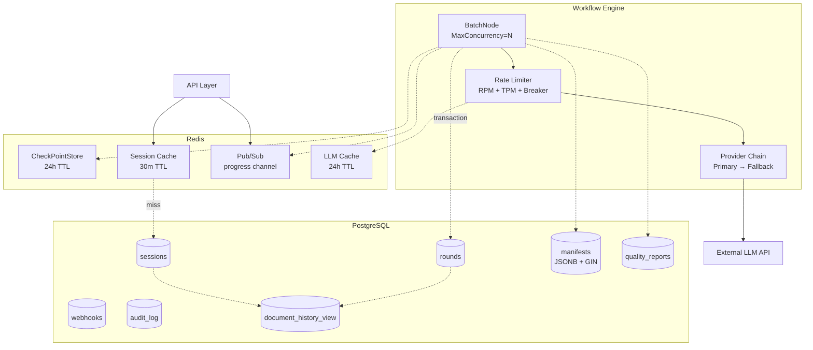

# Naturalize — 并发、存储与限流

## 1. 并发管理

### 1.1 BatchNode

Eino `BatchNode` 是 chunk 并发处理的核心组件：

```go
batchNode := batch.NewBatchNode(&batch.NodeConfig[ChunkInput, ChunkOutput]{
    InnerGraph:     chunkProcessingWorkflow,
    MaxConcurrency: 20,
    InnerCompileOptions: []compose.GraphCompileOption{
        compose.WithCheckPointStore(redisStore),
    },
})
```

| MaxConcurrency | 行为 |
| :--- | :--- |
| `0` | 串行处理 |
| `> 0` | 信号量控制的并行处理 |

MaxConcurrency 应根据 LLM Provider 的 RPM/TPM 限制动态配置。

### 1.2 Token Bucket 限流

双层限流防止 LLM API 过载：

```go
type RateLimitedLLMClient struct {
    inner      LLMClient
    rpmLimiter *rate.Limiter  // Requests Per Minute
    tpmLimiter *rate.Limiter  // Tokens Per Minute
    breaker    *gobreaker.CircuitBreaker
}

func (c *RateLimitedLLMClient) Complete(ctx context.Context, msgs []Message, opts ...LLMOption) (string, error) {
    if err := c.rpmLimiter.Wait(ctx); err != nil {
        return "", fmt.Errorf("rpm limit: %w", err)
    }
    
    result, err := c.breaker.Execute(func() (interface{}, error) {
        return c.inner.Complete(ctx, msgs, opts...)
    })
    if err != nil {
        return "", err
    }
    return result.(string), nil
}
```

### 1.3 熔断器

Provider 返回 5xx 或超时时，熔断器自动切断请求：

```go
breaker := gobreaker.NewCircuitBreaker(gobreaker.Settings{
    Name:        "llm-provider",
    MaxRequests: 3,                    // 半开状态允许的探测请求数
    Interval:    30 * time.Second,     // 统计窗口
    Timeout:     60 * time.Second,     // 熔断持续时间
    ReadyToTrip: func(counts gobreaker.Counts) bool {
        return counts.ConsecutiveFailures > 5
    },
    OnStateChange: func(name string, from, to gobreaker.State) {
        slog.Warn("circuit breaker state change",
            "name", name,
            "from", from.String(),
            "to", to.String(),
        )
        // 更新 Prometheus gauge
        circuitBreakerGauge.WithLabelValues(name).Set(float64(to))
    },
})
```

### 1.4 Provider Chain 容灾

多个 Provider 按优先级链式切换：

```go
type ProviderChainClient struct {
    providers []struct {
        client  *RateLimitedLLMClient
        config  ProviderConfig
        healthy atomic.Bool
    }
}

func (c *ProviderChainClient) Complete(ctx context.Context, msgs []Message, opts ...LLMOption) (string, error) {
    for _, p := range c.providers {
        if !p.healthy.Load() {
            continue
        }
        result, err := p.client.Complete(ctx, msgs, opts...)
        if err == nil {
            return result, nil
        }
        slog.Warn("provider failed, trying next",
            "provider", p.config.Name,
            "error", err,
        )
    }
    return "", ErrAllProvidersUnavailable
}
```

## 2. PostgreSQL：持久化核心

PostgreSQL 是系统的数据权威来源，充分利用其高级功能。

### 2.1 完整 Schema

```sql
-- =============================================
-- Sessions: 文档处理会话
-- =============================================
CREATE TABLE sessions (
    id              UUID PRIMARY KEY DEFAULT gen_random_uuid(),
    doc_id          TEXT NOT NULL UNIQUE,
    origin_path     TEXT NOT NULL,
    file_format     TEXT NOT NULL DEFAULT 'txt'
        CHECK (file_format IN ('txt', 'docx')),
    file_size_bytes BIGINT NOT NULL DEFAULT 0,
    prompt_profile  TEXT NOT NULL DEFAULT 'cn'
        CHECK (prompt_profile IN ('cn', 'en')),
    status          TEXT NOT NULL DEFAULT 'pending'
        CHECK (status IN ('pending', 'processing', 'paused', 'completed', 'failed')),
    tenant_id       UUID NOT NULL DEFAULT '00000000-0000-0000-0000-000000000000',
    created_at      TIMESTAMPTZ NOT NULL DEFAULT now(),
    updated_at      TIMESTAMPTZ NOT NULL DEFAULT now()
);

CREATE INDEX idx_sessions_status ON sessions (status);
CREATE INDEX idx_sessions_updated ON sessions (updated_at DESC);
CREATE INDEX idx_sessions_tenant ON sessions (tenant_id);

-- =============================================
-- Rounds: 改写轮次
-- =============================================
CREATE TABLE rounds (
    id                   UUID PRIMARY KEY DEFAULT gen_random_uuid(),
    session_id           UUID NOT NULL REFERENCES sessions(id) ON DELETE CASCADE,
    round_number         INT NOT NULL CHECK (round_number BETWEEN 1 AND 3),
    prompt               TEXT NOT NULL,
    prompt_profile       TEXT NOT NULL DEFAULT 'cn',
    input_path           TEXT NOT NULL,
    output_path          TEXT NOT NULL DEFAULT '',
    score_total          INT CHECK (score_total BETWEEN 0 AND 70),
    chunk_limit          INT NOT NULL DEFAULT 850,
    input_segment_count  INT,
    output_segment_count INT,
    checkpoint_id        TEXT,
    provider_used        TEXT,           -- 实际使用的 LLM Provider
    total_tokens         BIGINT DEFAULT 0,
    status               TEXT NOT NULL DEFAULT 'pending'
        CHECK (status IN ('pending', 'processing', 'paused', 'completed', 'failed')),
    started_at           TIMESTAMPTZ,
    completed_at         TIMESTAMPTZ,
    created_at           TIMESTAMPTZ NOT NULL DEFAULT now(),
    UNIQUE(session_id, round_number)
);

CREATE INDEX idx_rounds_session ON rounds (session_id);
CREATE INDEX idx_rounds_checkpoint ON rounds (checkpoint_id) WHERE checkpoint_id IS NOT NULL;
CREATE INDEX idx_rounds_status ON rounds (status) WHERE status IN ('processing', 'paused');

-- =============================================
-- Manifests: 分块清单 (JSONB)
-- =============================================
CREATE TABLE manifests (
    id              UUID PRIMARY KEY DEFAULT gen_random_uuid(),
    round_id        UUID NOT NULL UNIQUE REFERENCES rounds(id) ON DELETE CASCADE,
    chunk_limit     INT NOT NULL DEFAULT 850,
    chunk_metric    TEXT NOT NULL DEFAULT 'char'
        CHECK (chunk_metric IN ('char', 'word')),
    paragraph_count INT NOT NULL,
    chunk_count     INT NOT NULL,
    paragraphs      JSONB NOT NULL,
    chunks          JSONB NOT NULL,
    created_at      TIMESTAMPTZ NOT NULL DEFAULT now()
);

CREATE INDEX idx_manifests_chunks ON manifests USING GIN (chunks);

-- =============================================
-- Quality Reports: 质量检查结果
-- =============================================
CREATE TABLE quality_reports (
    id              UUID PRIMARY KEY DEFAULT gen_random_uuid(),
    round_id        UUID NOT NULL REFERENCES rounds(id) ON DELETE CASCADE,
    chunk_id        TEXT NOT NULL,
    check_type      TEXT NOT NULL,
    passed          BOOLEAN NOT NULL,
    reason          TEXT,
    recovered       BOOLEAN NOT NULL DEFAULT false,
    recovery_method TEXT,
    recovery_steps  INT DEFAULT 0,
    token_cost      INT DEFAULT 0,
    created_at      TIMESTAMPTZ NOT NULL DEFAULT now()
);

CREATE INDEX idx_qr_round ON quality_reports (round_id);
CREATE INDEX idx_qr_failed ON quality_reports (round_id) WHERE NOT passed;

-- =============================================
-- Webhooks: 外部回调配置
-- =============================================
CREATE TABLE webhooks (
    id          UUID PRIMARY KEY DEFAULT gen_random_uuid(),
    tenant_id   UUID NOT NULL,
    url         TEXT NOT NULL,
    secret      TEXT NOT NULL,
    events      TEXT[] NOT NULL,
    active      BOOLEAN NOT NULL DEFAULT true,
    created_at  TIMESTAMPTZ NOT NULL DEFAULT now(),
    updated_at  TIMESTAMPTZ NOT NULL DEFAULT now()
);

CREATE TABLE webhook_deliveries (
    id          UUID PRIMARY KEY DEFAULT gen_random_uuid(),
    webhook_id  UUID NOT NULL REFERENCES webhooks(id) ON DELETE CASCADE,
    event_type  TEXT NOT NULL,
    payload     JSONB NOT NULL,
    status_code INT,
    attempts    INT NOT NULL DEFAULT 0,
    last_error  TEXT,
    delivered_at TIMESTAMPTZ,
    created_at  TIMESTAMPTZ NOT NULL DEFAULT now()
);

CREATE INDEX idx_wd_webhook ON webhook_deliveries (webhook_id);
CREATE INDEX idx_wd_pending ON webhook_deliveries (created_at)
    WHERE delivered_at IS NULL AND attempts < 3;

-- =============================================
-- Audit Log: 审计日志
-- =============================================
CREATE TABLE audit_log (
    id          BIGSERIAL PRIMARY KEY,
    session_id  UUID REFERENCES sessions(id) ON DELETE SET NULL,
    action      TEXT NOT NULL,
    actor       TEXT NOT NULL DEFAULT 'system',
    detail      JSONB,
    created_at  TIMESTAMPTZ NOT NULL DEFAULT now()
);

CREATE INDEX idx_audit_session ON audit_log (session_id);
CREATE INDEX idx_audit_time ON audit_log (created_at DESC);
```

### 2.2 事务原子性

round 完成时的多表写入必须原子化：

```go
func (r *RoundRepo) CompleteRound(ctx context.Context, round *Round, manifest *Manifest, reports []QualityReport) error {
    return r.db.Transaction(func(tx *gorm.DB) error {
        if err := tx.Model(&Round{}).Where("id = ?", round.ID).Updates(map[string]interface{}{
            "status":               "completed",
            "output_path":          round.OutputPath,
            "score_total":          round.ScoreTotal,
            "input_segment_count":  round.InputSegments,
            "output_segment_count": round.OutputSegments,
            "provider_used":        round.ProviderUsed,
            "total_tokens":         round.TotalTokens,
            "completed_at":         time.Now(),
        }).Error; err != nil {
            return err
        }
        
        if err := tx.Create(manifest).Error; err != nil {
            return err
        }
        
        if len(reports) > 0 {
            if err := tx.CreateInBatches(reports, 100).Error; err != nil {
                return err
            }
        }
        
        return tx.Model(&Session{}).Where("id = ?", round.SessionID).
            Update("status", deriveSessionStatus(round)).Error
    })
}
```

### 2.3 Advisory Lock

同一文档不能同时执行两个 round：

```go
func (r *SessionRepo) AcquireLock(ctx context.Context, sessionID uuid.UUID) (func(), error) {
    lockKey := int64(crc32.ChecksumIEEE([]byte(sessionID.String())))
    
    var acquired bool
    r.db.Raw("SELECT pg_try_advisory_lock(?)", lockKey).Scan(&acquired)
    if !acquired {
        return nil, ErrSessionLocked
    }
    
    unlock := func() {
        r.db.Exec("SELECT pg_advisory_unlock(?)", lockKey)
    }
    return unlock, nil
}
```

### 2.4 物化视图

文档历史列表查询通过物化视图加速：

```sql
CREATE MATERIALIZED VIEW document_history_view AS
SELECT
    s.id AS session_id,
    s.doc_id,
    s.origin_path,
    s.prompt_profile,
    s.status,
    s.created_at,
    s.updated_at,
    COALESCE(
        jsonb_agg(
            jsonb_build_object(
                'round', r.round_number,
                'status', r.status,
                'score_total', r.score_total,
                'output_path', r.output_path,
                'provider_used', r.provider_used,
                'total_tokens', r.total_tokens,
                'created_at', r.created_at
            ) ORDER BY r.round_number
        ) FILTER (WHERE r.id IS NOT NULL),
        '[]'::jsonb
    ) AS rounds,
    MAX(r.round_number) AS latest_round,
    MAX(r.created_at) AS last_round_at,
    SUM(r.total_tokens) AS total_tokens
FROM sessions s
LEFT JOIN rounds r ON r.session_id = s.id
GROUP BY s.id;

CREATE UNIQUE INDEX idx_dhv_session ON document_history_view (session_id);

-- round 完成时并发刷新
REFRESH MATERIALIZED VIEW CONCURRENTLY document_history_view;
```

### 2.5 触发器

```sql
CREATE OR REPLACE FUNCTION update_timestamp()
RETURNS TRIGGER AS $$
BEGIN
    NEW.updated_at = now();
    RETURN NEW;
END;
$$ LANGUAGE plpgsql;

CREATE TRIGGER sessions_updated_at
    BEFORE UPDATE ON sessions
    FOR EACH ROW EXECUTE FUNCTION update_timestamp();

CREATE TRIGGER webhooks_updated_at
    BEFORE UPDATE ON webhooks
    FOR EACH ROW EXECUTE FUNCTION update_timestamp();
```

### 2.6 数据库迁移

使用 golang-migrate 管理版本化迁移：

```
internal/infra/postgres/migrations/
├── 000001_create_sessions.up.sql
├── 000001_create_sessions.down.sql
├── 000002_create_rounds.up.sql
├── 000002_create_rounds.down.sql
├── 000003_create_manifests.up.sql
├── 000003_create_manifests.down.sql
├── 000004_create_quality_reports.up.sql
├── 000004_create_quality_reports.down.sql
├── 000005_create_audit_log.up.sql
├── 000005_create_audit_log.down.sql
├── 000006_create_webhooks.up.sql
├── 000006_create_webhooks.down.sql
├── 000007_create_materialized_views.up.sql
└── 000007_create_materialized_views.down.sql
```

### 2.7 分区表（Phase 5）

```sql
CREATE TABLE rounds (
    ...
) PARTITION BY RANGE (created_at);

CREATE TABLE rounds_y2026q2 PARTITION OF rounds
    FOR VALUES FROM ('2026-04-01') TO ('2026-07-01');
```

### 2.8 连接池管理

```go
func Connect(cfg DatabaseConfig) *gorm.DB {
    db, err := gorm.Open(postgres.Open(cfg.DSN), &gorm.Config{
        Logger: gormLogger,
    })
    
    sqlDB, _ := db.DB()
    sqlDB.SetMaxOpenConns(cfg.MaxOpenConns)     // 默认 25
    sqlDB.SetMaxIdleConns(cfg.MaxIdleConns)     // 默认 10
    sqlDB.SetConnMaxLifetime(cfg.ConnMaxLife)    // 默认 1h
    sqlDB.SetConnMaxIdleTime(cfg.ConnMaxIdle)    // 默认 30m
    
    return db
}
```

## 3. Redis：高速缓存 + 消息

### 3.1 CheckPointStore

```go
type RedisCheckPointStore struct {
    client *redis.Client
    ttl    time.Duration  // 默认 24h
}

func (s *RedisCheckPointStore) Get(ctx context.Context, key string) ([]byte, bool, error) {
    val, err := s.client.Get(ctx, "cp:"+key).Bytes()
    if errors.Is(err, redis.Nil) {
        return nil, false, nil
    }
    return val, err == nil, err
}

func (s *RedisCheckPointStore) Put(ctx context.Context, key string, value []byte) error {
    return s.client.Set(ctx, "cp:"+key, value, s.ttl).Err()
}
```

### 3.2 Session 缓存

```go
type SessionCache struct {
    client *redis.Client
    ttl    time.Duration  // 默认 30m
    repo   SessionRepository  // 回源
}

func (c *SessionCache) GetProgress(ctx context.Context, sessionID string) (*SessionProgress, error) {
    data, err := c.client.Get(ctx, "sess:"+sessionID+":progress").Bytes()
    if errors.Is(err, redis.Nil) {
        return c.loadFromDB(ctx, sessionID)
    }
    var p SessionProgress
    json.Unmarshal(data, &p)
    return &p, nil
}

func (c *SessionCache) SetProgress(ctx context.Context, sessionID string, p *SessionProgress) error {
    data, _ := json.Marshal(p)
    return c.client.Set(ctx, "sess:"+sessionID+":progress", data, c.ttl).Err()
}

func (c *SessionCache) Invalidate(ctx context.Context, sessionID string) error {
    return c.client.Del(ctx, "sess:"+sessionID+":progress").Err()
}
```

### 3.3 Pub/Sub 进度推送

解耦 Workflow Worker 和 API 层的 SSE 连接：

```go
// Worker 端 — 每个 chunk 完成后发布
func (w *Worker) publishProgress(ctx context.Context, sessionID string, event ProgressEvent) {
    data, _ := json.Marshal(event)
    w.redis.Publish(ctx, "progress:"+sessionID, data)
}

// API 端 — SSE 连接订阅
func (h *SSEHandler) streamProgress(w http.ResponseWriter, sessionID string) {
    sub := h.redis.Subscribe(ctx, "progress:"+sessionID)
    defer sub.Close()
    
    flusher := w.(http.Flusher)
    for msg := range sub.Channel() {
        fmt.Fprintf(w, "event: progress\ndata: %s\n\n", msg.Payload)
        flusher.Flush()
    }
}
```

### 3.4 LLM 响应缓存

断点续传恢复时避免重复调用 LLM：

```go
func (c *LLMCache) GetOrCall(ctx context.Context, promptHash string, callFn func() (string, error)) (string, error) {
    cached, err := c.client.Get(ctx, "llm:"+promptHash).Result()
    if err == nil {
        return cached, nil
    }
    
    result, err := callFn()
    if err != nil {
        return "", err
    }
    
    c.client.Set(ctx, "llm:"+promptHash, result, 24*time.Hour)
    return result, nil
}
```

## 4. 职责边界

| 职责 | PostgreSQL | Redis |
| :--- | :--- | :--- |
| Session/Round 持久化 | 权威来源，事务保证 | 缓存热数据 |
| Manifest (JSONB) | GIN 索引，按 chunk 查询 | — |
| Quality Report | 持久化 + 统计聚合 | — |
| Webhook 配置/记录 | 持久化 | — |
| 审计日志 | 持久化 | — |
| 断点续传 | — | CheckPointStore |
| 实时进度 | — | Pub/Sub |
| 历史查询 | 物化视图加速 | — |
| 并发控制 | Advisory Lock | — |
| LLM 缓存 | — | TTL 控制 |
| Session 状态 | 权威来源 | 缓存 + 回源 |

## 5. 数据流


